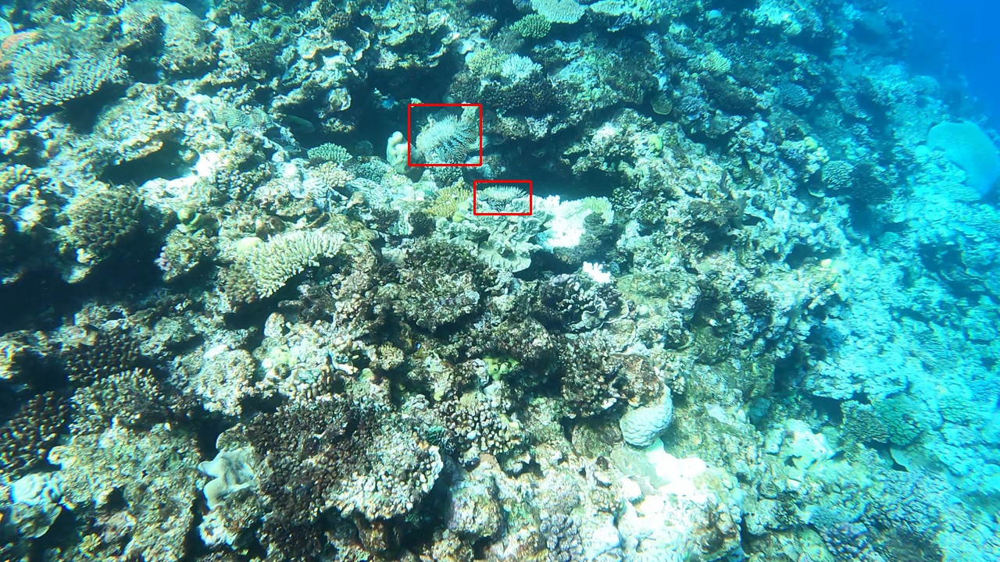

# Kaggle-Help-Protect-the-Great-Barrier-Reef

kaggle上的一个奖金赛：tensorFlow - Help Protect the Great Barrier Reef (Detect crown-of-thorns starfish in underwater image data) 

详细介绍：[TensorFlow - Help Protect the Great Barrier Reef | Kaggle](https://www.kaggle.com/c/tensorflow-great-barrier-reef/overview)

## 赛事简介

这项比赛的目标是通过珊瑚礁的水下视频建立目标检测模型，实时准确地识别海星。

数据为若干段视频，共23502帧视频，但其中大多数帧都没有待检测的目标。

参加这个比赛的原因是一来寒假没事做，二来觉得这个比赛和我之前调研过的Video Object Detection比较相关。

## 模型和数据集

模型：yolov5s (预训练的参数)

数据集：kaggle提供的训练集，未使用额外数据。

评估指标：F2-score

## 硬件和软件

设备：2080Ti

系统：Ubuntu 18.0

深度学习框架：Pytorch1.8

## 方法

#### 过程

题外话：这个比赛是拿不到测试数据的，需要用官方提供的数据接口写好自己的推理代码，并且提交的notebook需要能够不联网运行，这就导致配环境非常复杂。本来我是想用MMDetection的，但是在Kaggle上配置能不联网运行的MMDetection环境真的太折磨了，虽然最后参考大佬的教程配好了，但是每次调试都要重新编译mmcv-full真的太难受了。所以最后还是选择了更加方便的yolov5。

##### 数据预处理：

训练数据一共三段长视频，我删除了训练图片中没有待检测目标的帧，剩下的帧大约属于20多个小视频片段，将这些片段按10fold划分了训练集和验证集，没有直接随机划分的原因是视频相邻两帧的差异比较小，如果随机划分会造成验证集泄露。

将标签处理成yolov5的格式。

数据示例如下：

- **baseline：**yolov5s训练上述处理后的数据，所有的参数都设为默认值，仅修改image size为1280（因为图片的尺寸为1920*720）score：0.45
- **更复杂的模型：**尝试yolo5l，score：0.49，本来想尝试yolo5x，但是显存不够，size为1280时单卡batchsize就只能设为1了，即使使用了四卡并行效率也很低，遂放弃。
- **更大的image size：**尝试在验证的时候增大image size，发现在验证集上的score有所提升。于是尝试训练时也使用更大的image size，随后尝试下来训练的时候image size设为2560，推理的时候image size设为4800的效果是最好的。（在kaggle讨论区看到很多High resolution is all you need的帖子，他们甚至尝试了3600的image size来训练，image size=10000来推理，我只能说显存大了不起啊。不过线下尝试的时候更大的image size并没有起作用，猜测可能他们做数据增强的时候缩放比例更大，也有可能是我batchszie太小）score：0.6左右
- **Test-Time Augmentation：**推理时进行数据增强，然后对增强后的预测结果进行融合，为yolov5自带的功能。能稍微提升一点点分数。
- **数据增强：**调整了一下默认的数据增强方式，加强了HSV变换，扩大了缩放系数，mixup和cutpaste分别设为0.5。
- **调整置信度阈值：**默认的阈值为0.6，太高了。因为海星是比较容易和背景混淆的目标，观察模型的输出发现有很多置信度只有0.3左右的检测框其实是正确的。同时这个比赛的评估函数是F2-score，所以召回率更加重要。修改了yolov5中的f1-score计算函数，在log文件中记录每一轮的f2-score。模型训练完成后，观察在验证集上的f2-score曲线，选择最好的置信度阈值。阈值设为0.45的时候，分数可以达到0.65左右。
- **Tracking：**因为是视频信息，所以将前后帧关联起来一定比单看一帧图像更好，所以使用一个简单的目标跟踪器跟踪每一个海星，并预测它在下一帧会出现的位置和概率，与下一帧的目标检测结果进行融合，具体的实现借助了[norfair](https://github.com/tryolabs/norfair)库，所以实现起来并不复杂。

#### 最终方案

模型：yolov5s，使用预训练的模型初始化。

训练时的image size为2560，推理时的size为4800，并进行Test-Time Augmentation，置信度阈值为0.45。

使用目标跟踪算法结合前面几帧的检测结果对当前帧进行修正。

最终提交的notebook：`yolov5-tracking.ipynb`

#### 其他方案

尝试了一些（或者来不及尝试）我觉得可能会有用的方法，但是分数并没有提高：

- **Model Ensemble：**10折交叉验证，选取其中三折训练的模型进行WBF融合（目标框加权融合），利用ensemble_boxes PyPI实现，提交过一次效果并不好，后面也没有时间训练更多的模型用于调试，所以就放弃了。

- 加入一部分没有目标的训练集：按照yolov5官方文档中推荐的，加了10%，没什么用。

- **滑窗：**在较大的图片进行检测时，首先使用滑动窗口法对图像进行切片，将切片输入网络，再对得到的预测结果进行拼接，借助[SAHI](https://github.com/obss/sahi)实现。设置的滑动窗口大小为512*512，overlap=0.2，但是分数反而下降了，猜测可能是训练的时候图像为整张输入，所以对训练集的图片进行crop，删除了没有目标的部分，重新训练模型，但依然没有提升。由于时间和算力的关系就没有深入研究了。

- **soft-NMS：**将yolov5的后处理模块NMS改成soft-NMS，和不改没什么区别

- **tph-yolov5：**在其他比赛的经验帖中看到的，给yolov5加了基于transformer结构的小目标检测头，具体可见我魔改过的yolov5：`yolov5/models/common.py`。用这个改过的yolov5s比不改的更差，可能是因为本身训练数据也不是很多，tph-yolov5没有预训练的模型。（yolov5s随机初始化要比使用预训练模型低0.08左右）

- 水下数据预处理：用了[Scalsol/mega.pytorch: Memory Enhanced Global-Local Aggregation for Video Object Detection, CVPR2020 (github.com)](https://github.com/Scalsol/mega.pytorch)中实现的一些方法，并可视化了处理结果，最后结合处理时间和效果，选择了CLAHE算法对图像进行预处理，但是没什么效果。可能是这个虽然是水下图像，但已经足够清晰了，处理之后的图像质量也并没有明显提高，反而远处的色彩还出现了偏差

- Image blending数据增强：不如直接cut-paste简单好用

- **Video Anomaly Detection**领域用到的方法

  由于这是视频目标检测，所以想尝试一些论文中看起来非常noval的方法，但是真的去做的时候发现很多方法都不能实现实时检测，有些方法由于开源代码不完整等原因，导致复现的过程遇到很多困难，最后真的试过的就下面这两种：

  - [seq-NMS](https://arxiv.org/abs/1602.08465)：这个方法的思路简单直接，对整个视频的候选框（进入后处理模块NMS之前）统一进行处理：

    - 相邻两帧之间的候选框如果IoU超过阈值，认为可能是同一个物体，将他们连接起来。对整段视频，找到使这个分数最大化的连接方式
    - 对属于同一个物体的候选框分数进行调整，取最大或者取平均
    - 在每一帧上运行NMS算法，使用调整后的分数。

    其实这也是一个离线的处理过程，我稍微魔改了一下：

    - 对前几帧不做处理，只保留低置信度阈值下的bboxes list
    - 对连续10帧（当前帧+前9帧）的bboxes list使用seq-NMS算法处理，处理之后的分数再使用阈值0.45进行过滤。

    没有得到什么提升，但我觉得这个方法很简洁同时不需要改变yolov5的模型，是一个很有潜力的方法，虽然后面来不及优化了。。。

    我认为目前的主要缺陷在于没有判断当前帧是否是属于前一段视频的（不确定线上的测试集是否来源于一段完整的视频），如果其中发生了视频片段的切换，seq-NMS可能会产生错误的关联。

  - [MEGA](https://arxiv.org/abs/2003.12063)：差不多是这几年Video Object Detection领域的SOTA了，作者是个巨佬，基于maskrcnn_benchmark实现了很多VOD方向的方法，包括他自己的。我在这个海星数据集上做了一下实验，效果并不理想。不过这个领域目前都是在ImageNet VID上做的实验，这个数据集的目标都比较大，分布比赛数据集很不一样，算法没有图像目标检测这么久经考验，泛化能力也不强。所以我认为目前在小数据集上进行视频目标检测还是用图像目标检测+后处理模块更合适。

- **伪装目标检测（Camouflage Object Detection）：**

  传统的显著性目标检测（SOD）的工作原理是识别图像中最引人注意的目标，然而，像海星这种和背景有很多相似之处的目标，使得它很难被发现，可以认为是伪装目标检测（SOD）。这也是一个挺有意思的小领域，但是看了几篇文章都是需要像素级mask来训练的。

## 最终成绩

银牌 top4%

A榜：0.679

B榜：0.683

## 感想

第一次打kaggle，能拿到银牌也很开心了。这次吸取了上次天池的经验教训，比较注重线下验证的结果，所以最后B榜也没有翻车，本来最后A榜都已经掉到铜牌区了，感觉已经没了，最后挑了分数最高的版本和3个线下验证最好的版本作为最终提交。没想到最后B榜一开，很多A榜分数靠前的人排名都下降了，最后成功拿到银牌，实现小目标。

比较遗憾的是当时开始这个比赛比较晚了，时长三个月的比赛我开始做的时候只有一个月了，受限于时间和算力，有很多想法都来不及尝试和优化。

## TOP方案总结

// TODO

## Reference

- [ultralytics/yolov5: YOLOv5 🚀 in PyTorch > ONNX > CoreML > TFLite (github.com)](https://github.com/ultralytics/yolov5)
- [obss/sahi: A lightweight vision library for performing large scale object detection/ instance segmentation. (github.com)](https://github.com/obss/sahi)
- [lrghust/Seq-NMS: An implementation of Seq-NMS (github.com)](https://github.com/lrghust/Seq-NMS)
- [Scalsol/mega.pytorch: Memory Enhanced Global-Local Aggregation for Video Object Detection, CVPR2020 (github.com)](https://github.com/Scalsol/mega.pytorch)
- [Scalsol/mega.pytorch: Memory Enhanced Global-Local Aggregation for Video Object Detection, CVPR2020 (github.com)](https://github.com/Scalsol/mega.pytorch)

